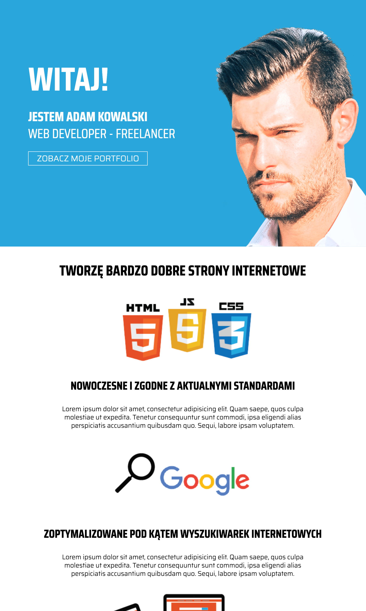

# Project Portfolio 

My graduation project from course [WebSamuraj on Udemy.](https://www.udemy.com/course/kurs-web-developer-od-podstaw-w-15-dni/learn/lecture/11270344?start=0#overview)

Goal of the project:
Build first ever complete static landing page based on skills from 15 days course. 

## Lessons Learned:
* How to structure and use semantic HTML
* How to make responsive design with using plain CSS

## Stack
* HTML
* CSS

### Live
https://maciejgl.github.io/Project-Porfolio---WebSamuraj/

